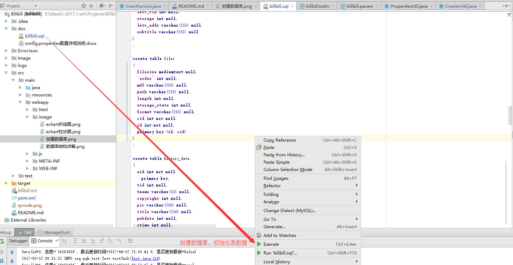
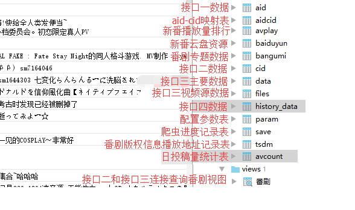

# Bilibili 
哔哩哔哩爬虫系统 
开发语言： 
Java1.8 
项目框架： 
SpringMVC+MyBatis 
数据库： 
Mysql5.7 
开发IDE： 
IDEA 15 
---------------------------------------------- 
<h1 >实现功能：</h1> 
<h2 >1.获取以下三个接口信息并写入数据库</h2> 
接口一：http://api.bilibili.com/view?access_key={access_key}&appkey={appkey}&id={aid}&page={page}&type=xml 
接口二：http://interface.bilibili.com/player?id=cid:{cid} 
<strike>接口三：http://api.bilibili.com/vstorage/state?cid={cid}该接口已被封但是数据保留</></strike> 
改用这两个接口：
http://api.bilibili.com/x/v2/history?access_key={0}&pn={1}&ps={2} 
http://api.bilibili.com/x/v2/history/{0} 
首先主动添加历史记录，然后再获取历史记录，再清除历史记录，三个步骤不断重复，达到获取所有视频数据目的。 
历史记录接口数据相比于接口三数据只是没有视频源信息,不过够用了。 

<a href="http://ww2.sinaimg.cn/large/005Jr6NYgw1f5x82npzo1g310b0lse8e.gif">接口数据作用一睹为快</a> 

看完上面的小短片就应该明白这些数据是搭配bilibili黑科技食用的，通过aid(AV号)或者cid(弹幕号)看到被和谐的视频，
这些接口就是用来收集这些数据的，基本上只要是存在过B站的视频都能找到 
例如：<b>缘之空、日在校园、学园默示录、记忆女神的女儿们、新妹魔王的契约者等</b> 
这些数据除了拿来找被删视频弹幕之外，当然还可以拿这些数据做各种各样的统计。

<b><a href="http://pqh.share666.com">完整数据在线查询</a>帐号:bilibili 密码:2233</b>

----------------------------------------------------------------------------------------------------------------- 
项目初始化： 
第一步：jar包都是用Maven进行管理的，所以项目克隆下来还要从Maven本地仓库/远程仓库中加载jar包。 
第二步：用<a href="https://github.com/luffy9412/Bilibili/blob/master/doc/bilibili.sql">数据库表创建脚本</a>创建数据库以及表 
 
如无意外创建完毕表结构应该跟下图一样。
数据库结构图
 
<a href="http://ww3.sinaimg.cn/large/005Jr6NYgw1f5x22mc4zlg30x40bye81.gif">数据库部分数据展示</a> 
第三步：参数配置 
配置好以下4个参数，其他默认配置即可。 
localPath	数据库本地备份目录 
serverPath	数据库同步盘备份目录/打包目录 
dbusername	数据库账号 
dbpassword	数据库密码 
 
第四步：启动爬虫测试 
打开<a href="src/main/java/org/pqh/test/Test.java">爬虫测试类运行main方法即可</a> 
------------------------------------------------------------------------------------------------------------------------------------------------- 
数据库是自动定时备份，默认每天0点和12点各备份一次，具体配置项看<a href="src/main/resources/config.properties">配置文件</a> 
关于项目问题可以<a href="http://tieba.baidu.com/im/pcmsg?from=820363216">私信</a> 

