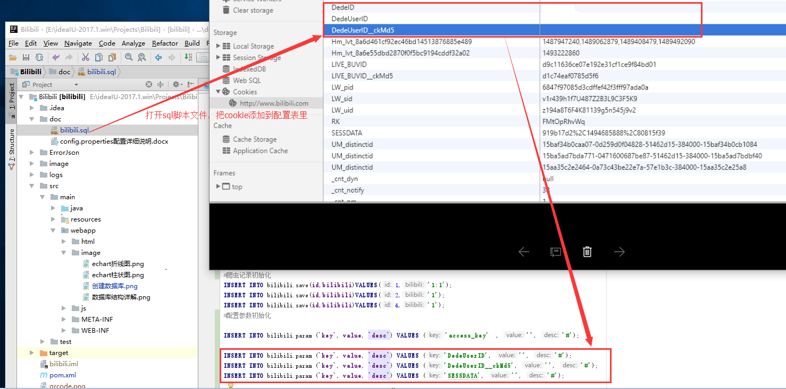

# Bilibili 
哔哩哔哩爬虫系统 
项目框架： 
SpringMVC+MyBatis 
数据库： 
Mysql5.7 
开发环境： 
JRE: 1.8.0_112-release-736-b13 amd64 
IntelliJ IDEA 2017.1 
Windows 10 
---------------------------------------------- 

<b><a href="https://mikuhime.xyz">爬虫数据库(phpMyAdmin)</a>帐号:bilibili 密码:2233</b>

<h1 >简介：</h1> 
这个爬虫系统，主要采集B站视频相关信息，其中用到的相关接口都在这个 
<a href="src/main/java/org/pqh/util/ApiUrl.java">枚举</a>里面了 

<a href="http://ww2.sinaimg.cn/large/005Jr6NYgw1f5x82npzo1g310b0lse8e.gif">用接口数据看视频</a> 

看完上面的小短片就应该明白这些数据是搭配bilibili黑科技食用的，通过aid(AV号)或者cid(弹幕号)看到被和谐的视频，
这些接口就是用来收集这些数据的，基本上只要是存在过B站的视频都能找到 
例如：<b>缘之空、日在校园、学园默示录、记忆女神的女儿们、新妹魔王的契约者等</b> 
这些数据除了拿来找被删视频弹幕之外，当然还可以拿这些数据做各种各样的统计。

----------------------------------------------------------------------------------------------------------------- 
项目初始化： 
第一步：项目是用构建工具maven构建的，所以项目克隆下来还要从Maven本地仓库/远程仓库中加载jar包。 
第二步：用<a href="https://github.com/luffy9412/Bilibili/blob/master/doc/bilibili.sql">数据库表创建脚本</a>创建数据库以及表,初始化配置参数 
其中要手动往sql脚本文件添加access_token参数或者DedeUserID、DedeUserID__ckMd5、SESSDATA这三个参数 
二选一，否则bilibili接口请求失败 
其中access_token是手机bilibili客户端用到的参数，需要通过捉手机客户端包才可以找到。例如使用这个<b>fiddler</b>捉包工具。 
而设置cookie就简单得多。如下图打开chrome浏览器(其他浏览器差不多)，开发者工具，找到查看cookie的地方，把红框里的三个值添加到数据库的param表里面 
 
如无意外创建完毕表结构应该跟下图一样。
数据库结构图
 
<a href="http://ww3.sinaimg.cn/large/005Jr6NYgw1f5x22mc4zlg30x40bye81.gif">数据库部分数据展示</a> 
第三步：参数配置 
配置好以下4个参数，其他默认配置即可。 
localPath	mysql本地备份目录 
serverPath	mysql同步盘备份目录/打包目录 
dbusername	mysql账号 
dbpassword	mysql密码 
 
第四步：启动爬虫测试 
打开<a href="src/main/java/org/pqh/test/Test.java">爬虫测试类运行main方法即可</a> 
------------------------------------------------------------------------------------------------------------------------------------------------- 
数据库是自动定时备份，默认每个星期一零点备份一次，修改配置请自行打开<a href="src/main/resources/config.properties">配置文件dbbackup修改cron定时器表达式</a> 
<a href="http://cron.qqe2.com/">cron表达式在线生成地址</a> 
关于项目问题可以<a href="http://tieba.baidu.com/im/pcmsg?from=820363216">私信</a> 

